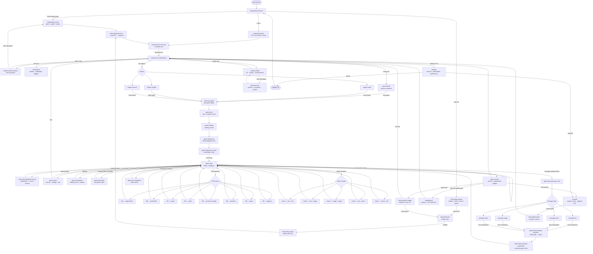

---
planStatus:
  planId: plan-app-flow-and-gaps
  title: AceQuest B2C App — Screen Flow & Gap Analysis
  status: draft
  planType: system-design
  priority: high
  owner: raghavrohatgi
  stakeholders: []
  tags:
    - flowchart
    - b2c
    - ux
    - gaps
    - mockup
  created: "2026-02-14"
  updated: "2026-02-14T06:30:00.000Z"
  progress: 100
---
# AceQuest B2C App — Complete Screen Flow & Gap Analysis

> **Launch strategy**: B2C (direct to students/parents). No school/teacher portal needed for v1. Fastest path to market.

---

## Full Screen Flow (Login → Logout)



---

## Screens: Exists vs. Missing

| Screen | File | Status | Notes |
| --- | --- | --- | --- |
| Welcome / Splash | `onboarding-welcome` | ✅ Done |  |
| Sign Up | `onboarding-signup` | ✅ Done | 2-col form, OTP, play-first escape |
| Log In | `onboarding-login` | ✅ Done | Mobile/email tabs, recent profiles |
| Avatar + Name + Grade | `onboarding-avatar` | ✅ Done | Skips name/grade if from signup |
| Profile Selector | `student-profile-selector` | ✅ Done | Multi-child, Add New Player linked |
| Home (first-time) | `student-home-first-time` | ✅ Done |  |
| Home (returning) | `student-home-dashboard` | ✅ Done |  |
| Student Profile | `student-profile` | ✅ Done |  |
| Math Subject Page | `subject-math` | ✅ Done |  |
| English Subject Page | `subject-english` | ✅ Done |  |
| Science Subject Page | `subject-science` | ✅ Done |  |
| Pre-Game Lobby | `game-pre-game` | ✅ Done |  |
| Diagnostic Test | `game-diagnostic` | ✅ Done |  |
| Diagnostic Results | `game-diagnostic-results` | ✅ Done |  |
| Gameplay (MCQ) | `game-play` | ✅ Done |  |
| FITB (9 variants) | `game-play-fitb-*` | ✅ Done |  |
| Match (5 variants) | `game-play-match-*` | ✅ Done |  |
| Passage Cover | `game-play-passage-cover` | ✅ Done |  |
| Passage Text | `game-play-passage-text` | ✅ Done |  |
| Passage Audio | `game-play-passage-audio` | ✅ Done |  |
| Passage Image | `game-play-passage-image` | ✅ Done |  |
| Passage Video | `game-play-passage-video` | ✅ Done | Compact + expandable player |
| Passage Question | `game-play-passage-question` | ✅ Done | 50/50 split view |
| Passage Explanation | `game-play-passage-explanation` | ✅ Done |  |
| FITB Passage | `game-play-fitb-passage` | ✅ Done |  |
| Post-Game Results | `game-results` | ✅ Done |  |
| **OTP Verification** | `onboarding-otp.mockup.html` | ✅ Done | 6-digit box entry, countdown timer, resend link |
| **Settings / Logout** | `settings.mockup.html` | ✅ Done | Account info, subscription, preferences, dark mode toggle, logout |
| **Payment / Upgrade** | `paywall.mockup.html` | ✅ Done | Monthly/annual toggle, 7-day trial, feature list, free tier usage bar |
| **Progress Nudge** | `save-progress-nudge.mockup.html` | ✅ Done | Post-game sheet for guests showing XP at risk, inline phone entry |
| **Game Intro / Story** | `game-intro.mockup.html` | ✅ Done | Dark space theme, story hook, game metadata |
| **Game Loading** | `game-loading.mockup.html` | ✅ Done | Animated mascot, loading bar, fun tip |
| **Pause Menu** | `game-pause.mockup.html` | ✅ Done | Mid-game stats, resume/quit/settings |
| **Mid-game Checkpoint** | `game-checkpoint.mockup.html` | ✅ Done | Halfway stats, confetti, next section hint |
| **Mid-game Video** | `game-play-video.mockup.html` | ✅ Done | Concept video interstitial between question sets |
| **Dropdown Question** | `game-play-dropdown.mockup.html` | ✅ Done | Inline dashed pills, floating dropdowns, feedback |
| **Wrong Answer Detail** | `game-play-feedback-wrong.mockup.html` | ✅ Done | Your answer vs correct + step-by-step explanation |
| **Achievements Wall** | `achievements.mockup.html` | ✅ Done | Earned / In Progress / Locked, XP summary banner |
| **Subscription Plans** | `subscription-plans.mockup.html` | ✅ Done | Annual/monthly toggle, comparison table, free tier |
| **Game Library** | `game-library.mockup.html` | ✅ Done | Search, subject tabs, trending, continue, completed |
| **Tutorial step 1** | `onboarding-tutorial-1.mockup.html` | ✅ Done | Answer questions, earn XP |
| **Tutorial step 2** | `onboarding-tutorial-2.mockup.html` | ✅ Done | Compete on the leaderboard |
| **Tutorial step 3** | `onboarding-tutorial-3.mockup.html` | ✅ Done | Play free, upgrade anytime |
| **Leaderboard (full)** | `leaderboard.mockup.html` | ✅ Done | Podium, full ranked list, sticky your-rank strip |
| **Notifications** | `notifications.mockup.html` | ✅ Done | Streak reminders, badges, challenges, weekly summary |

---

## Gap Summary by Priority

### 🔴 P0 — Needed Before Any User Testing — ✅ ALL DONE
| Gap | Status |
| --- | --- |
| OTP Verification screen | ✅ Done — `onboarding-otp.mockup.html` |
| Settings + Logout | ✅ Done — `settings.mockup.html` |
| Save Progress Nudge | ✅ Done — `save-progress-nudge.mockup.html` |
| Paywall / Free Tier Limit | ✅ Done — `paywall.mockup.html` (monthly/annual, 7-day trial) |

### 🟡 P1 — Needed for Complete Core Loop ✅ All Done
| Screen | File | Status |
| --- | --- | --- |
| Game Intro / Story | `game-intro.mockup.html` | ✅ Done |
| Pause Menu | `game-pause.mockup.html` | ✅ Done |
| Mid-game Checkpoint | `game-checkpoint.mockup.html` | ✅ Done |
| Wrong Answer Detail | `game-play-feedback-wrong.mockup.html` | ✅ Done |
| Game Library | `game-library.mockup.html` | ✅ Done |
| Subscription Plans | `subscription-plans.mockup.html` | ✅ Done |

### 🟢 P2 — Polish / Nice-to-Have ✅ All Done
| Screen | File | Status |  |
| --- | --- | --- | --- |
| Game Loading screen | `game-loading.mockup.html` | ✅ Done |  |
| Mid-game Video interstitial | `game-play-video.mockup.html` | ✅ Done |  |
| Dropdown question type | `game-play-dropdown.mockup.html` | ✅ Done |  |
| Achievements Wall | `achievements.mockup.html` | ✅ Done |  |
| Tutorial step 1 | `onboarding-tutorial-1.mockup.html` | ✅ Done |  |
| Tutorial step 2 | `onboarding-tutorial-2.mockup.html` | ✅ Done |  |
| Tutorial step 3 | `onboarding-tutorial-3.mockup.html` | ✅ Done |  |
| Full Leaderboard | `leaderboard.mockup.html` | ✅ Done |  |
| Notifications screen | `notifications.mockup.html` | ✅ Done |  |

---

## B2C Monetisation Flow (Recommended)

```
Guest plays 1 full game free
    ↓
End of game → "Save your progress!" nudge → Register (mobile OTP)
    ↓
Registered user gets 3 games/week free
    ↓
Hits free limit → Paywall screen → Plan selection (₹99/month or ₹799/year)
    ↓
Payment → Unlimited access
```

This defers payment until the student has experienced real value — reduces friction at download and increases conversion.

---

## All Screens — Complete ✅

P0, P1, and P2 screens are all built. The full core loop is mocked up end to end from app launch → gameplay → results → paywall → logout.
