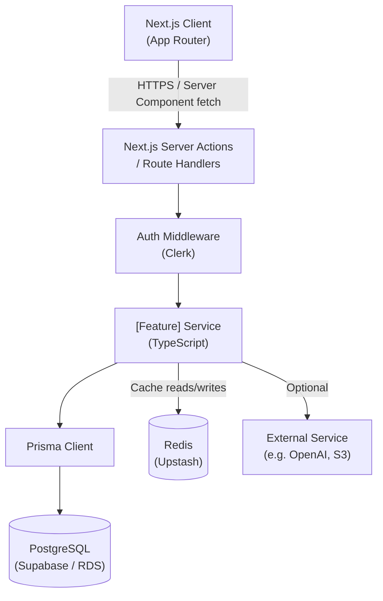
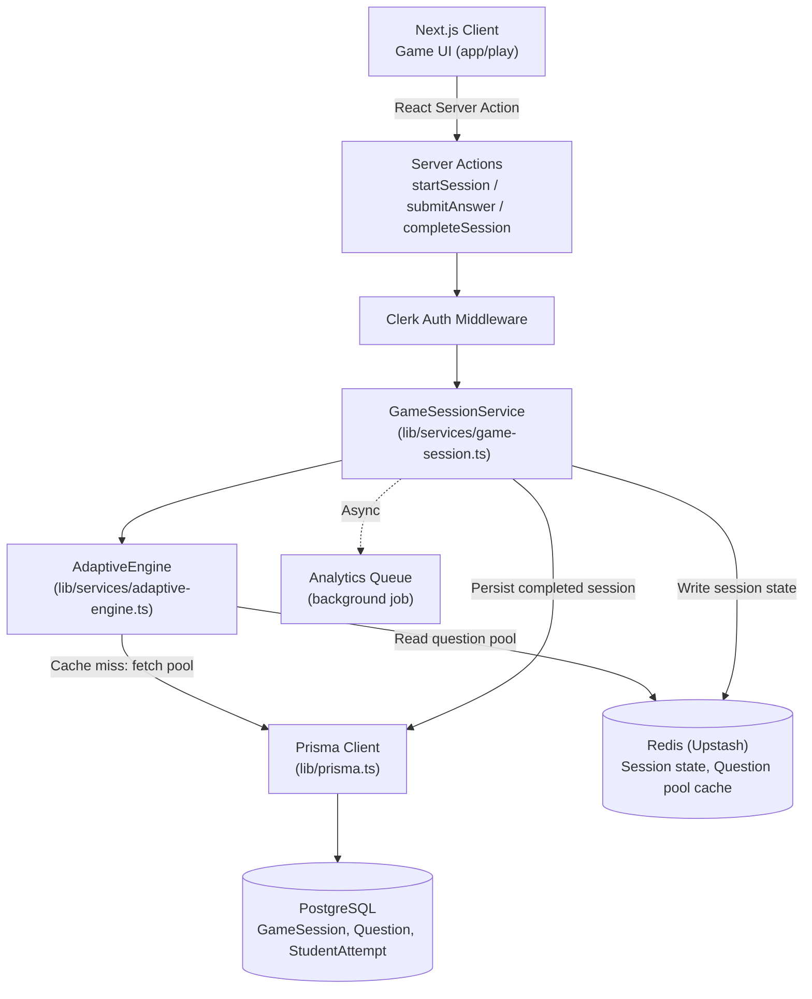

# Skill: design-system-architecture

## Purpose

Produce a system architecture document for a new feature or subsystem. This document defines components, data flows, integration points, and non-functional requirements before any code is written. It is the primary deliverable before the Software Architect hands off to the Backend Engineer, Database Engineer, and Frontend Engineer agents.

Architecture documents prevent engineers from building inconsistent subsystems, surface integration risks early, and provide a permanent record of why the system is designed the way it is.

## Used By

Software Architect Agent

## Inputs

| Input | Type | Description |
| --- | --- | --- |
| `feature_name` | string | Name of the feature or subsystem |
| `user_types_involved` | list | Which user personas interact with it (student gr3–8, parent, guest, admin) |
| `data_flows` | list | Description of data as it moves through the system |
| `integration_points` | list | External services or internal subsystems this feature touches |
| `performance_requirements` | string | Latency, throughput, or availability targets |

## Procedure / Template

**Step 1 — Write the Overview.** One paragraph placing this feature in the context of AceQuest's overall product. State what it does, who uses it, and what success looks like.

**Step 2 — Draw the Component Diagram** using Mermaid. Identify: the client (Next.js), server (API routes / Server Actions), services (business logic), data stores (PostgreSQL via Prisma, Redis), and external services (auth, content delivery, AI providers if any).

**Step 3 — Map Data Flows.** For each major user action, trace the complete path: browser → server → service → database → response. Be specific about what is fetched, transformed, or cached at each step.

**Step 4 — Enumerate API Dependencies.** List which endpoints this feature exposes (link to API spec) and which external/internal APIs it consumes.

**Step 5 — Describe Database Changes.** List the new tables, modified tables, or new indexes required. Reference the DB schema plan (link to `plan-db-schema` output).

**Step 6 — List Third-Party Integrations.** For each: what it does, how it is called, what the fallback is if it is unavailable.

**Step 7 — Define Non-Functional Requirements.** Be specific and measurable. Vague statements ("it should be fast") are not acceptable.

**Step 8 — Document Risks and Mitigations.**

**Step 9 — List Open Questions** for the human engineer to resolve.

---

```markdown
# System Architecture: [Feature Name]

**Version:** 1.0
**Date:** YYYY-MM-DD
**Author:** Software Architect Agent
**Status:** draft | approved
**Related ADRs:** [list ADR numbers]
**Related API Spec:** [link]
**Related DB Schema Plan:** [link]

---

## Overview

[2–4 sentences. What is this feature? Who uses it? What problem does it solve for AceQuest students (grades 3–8 in India, CBSE curriculum)? What is the expected scale?]

---

## Component Diagram



[Describe the diagram in prose — what each component's responsibility is, and why components are separated the way they are.]

---

## Data Flow

### Flow 1: [User action name — e.g. "Student starts a game session"]

1. **Client:** Student clicks "Play" on chapter card → `startGameSession(chapterId)` Server Action is called
2. **Auth:** Clerk `auth()` validates JWT; extracts `userId`, `role`, `grade`
3. **Service:** `GameSessionService.create({ studentId, chapterId, grade })` is called
4. **Cache check:** Service checks Redis key `chapter:${chapterId}:questions:${grade}` — cache hit returns question pool in ~2ms
5. **Cache miss path:** Service queries PostgreSQL via Prisma for active questions in the chapter pool
6. **Question selection:** Adaptive algorithm selects N questions weighted by student's prior performance on each concept
7. **DB write:** New `GameSession` record created with `status: in_progress`; selected question IDs stored
8. **Cache write:** Selected question set stored in Redis with key `session:${sessionId}:questions`, TTL 30 minutes
9. **Response:** Session object with first question batch returned to client (~80ms target p95)

### Flow 2: [Next user action]

[Repeat for each significant flow]

---

## API Dependencies

### Endpoints Exposed (this feature's API)

See full spec: `/docs/api/[feature]-api-spec.md`

| Endpoint | Description |
| --- | --- |
| `POST /api/v1/[resource]` | [Description] |
| `GET /api/v1/[resource]/:id` | [Description] |

### Internal APIs Consumed

| Service | Endpoint / Method | Purpose |
| --- | --- | --- |
| Student Profile Service | `getStudentPerformance(studentId)` | Personalise question selection |
| Notification Service | `sendXpNotification(studentId, xp)` | Award XP on session complete |

### External APIs Consumed

| Service | Purpose | Fallback if unavailable |
| --- | --- | --- |
| [e.g. OpenAI GPT-4o] | [e.g. Generate hint text] | Serve pre-generated static hints |
| [e.g. AWS S3] | [e.g. Serve question images] | Show text-only fallback question |

---

## Database Changes

See full schema plan: `/docs/architecture/[feature]-schema-plan.md`

### New Tables

| Table | Purpose |
| --- | --- |
| `game_sessions` | Stores game session lifecycle and score |
| `question_attempts` | Stores per-question student answer and timing |

### Modified Tables

| Table | Change |
| --- | --- |
| `students` | Add `totalXp` column (Int, default 0) |
| `chapters` | Add `questionPoolSize` column (Int) |

### New Indexes

| Table | Index | Query served |
| --- | --- | --- |
| `game_sessions` | `(studentId, status)` | Find active sessions per student |
| `question_attempts` | `(sessionId)` | Fetch all attempts for a session |

---

## Third-Party Integrations

### [Integration Name — e.g. Clerk Authentication]

- **Purpose:** [What it does in this feature]
- **How called:** [Middleware / Server Component / API route]
- **Data exchanged:** [What is sent/received]
- **Failure mode:** [What happens if the service is down]
- **Fallback:** [How the system degrades gracefully]

---

## Non-Functional Requirements

### Performance

| Metric | Target | Notes |
| --- | --- | --- |
| Game session creation (p95) | < 200ms | Including question selection |
| Session state fetch (p95) | < 50ms | Redis cache hit path |
| Session completion + scoring (p95) | < 300ms | Includes DB write + XP calculation |
| Question pool cache TTL | 5 minutes | Acceptable staleness for edited questions |

### Scalability

| Scenario | Expectation |
| --- | --- |
| Concurrent active sessions | 10,000 |
| Question pool size per chapter | Up to 500 questions |
| Peak requests during exam season | 3× normal load (spike to ~30K RPS on game API) |

Design decisions to support scale:
- Question pools cached in Redis — no DB hit on session creation for warm cache
- Stateless service layer — horizontal scaling via Vercel serverless
- Session state stored in Redis for in-flight sessions (not read from DB mid-session)

### Security

| Concern | Mitigation |
| --- | --- |
| Student data privacy (minors) | No PII in Redis keys; session data uses opaque IDs |
| Question answer leakage | Correct answers never sent to client; only validated server-side on completion |
| Session hijacking | Session ID bound to `studentId`; all session reads verify ownership |
| COPPA / India DPDP Act | No behavioural data shared with third parties; all analytics stored on-premise in PostgreSQL |

### Reliability

- Target availability: 99.9% (excludes planned maintenance)
- Session expiry: 30-minute TTL enforced server-side — prevents orphaned sessions
- Idempotent completion: PATCH `/complete` is safe to call multiple times

---

## Risks and Mitigations

| Risk | Likelihood | Impact | Mitigation |
| --- | --- | --- | --- |
| Redis unavailable during session | Low | High | Fallback to PostgreSQL for session state; log degradation |
| Question pool too small for adaptive algorithm | Medium | Medium | Minimum pool size validation on chapter publish |
| AI hint generation latency (if applicable) | Medium | Low | Pre-generate hints at question-creation time; async generation |
| DB connection exhaustion at peak load | Medium | High | Prisma Accelerate connection pooling; circuit breaker |

---

## Open Questions

- [ ] Should guest sessions be persisted to DB for analytics, or Redis-only? (Decision needed before implementation)
- [ ] What is the XP formula? Does time-to-answer affect XP? (Product decision)
- [ ] Should question images be stored in S3 or served from a CDN in front of the DB? (Infra decision)
- [ ] Is the adaptive algorithm a separate service or in-process? (Architecture decision — may need ADR)

---
```
## Output

A markdown architecture document saved as `/docs/architecture/[feature-name]-architecture.md`.

## Quality Checks

Before handing off to the implementation agents, verify:

- [ ] Performance targets are specific and measurable (e.g. `<200ms p95`, not "fast")
- [ ] Security considerations explicitly address student data and privacy for Indian minors
- [ ] Scalability to 10,000 concurrent users is considered
- [ ] Every external integration has a defined fallback/degradation path
- [ ] Mermaid component diagram is present and syntactically valid
- [ ] All significant data flows are traced end-to-end (client → DB → response)
- [ ] Database changes section references the schema plan document
- [ ] Risks table covers at least 4 risks with mitigations
- [ ] Open questions are actionable and assigned to a decision-maker

## Example

**Scenario:** Architecture for the Adaptive Game Engine.

```markdown
# System Architecture: Adaptive Game Engine

**Version:** 1.0
**Date:** 2025-01-20
**Status:** approved
**Related ADRs:** 0001 (Prisma), 0004 (Redis for session state)
**Related API Spec:** /docs/api/game-sessions-api-spec.md
**Related DB Schema Plan:** /docs/architecture/game-engine-schema-plan.md

---

## Overview

The Adaptive Game Engine is the core of AceQuest's educational experience. It selects questions from a chapter's question pool, adjusts difficulty based on the student's live performance within a session, and calculates a final score and concept mastery profile on completion. It serves students in grades 3–8 playing CBSE-aligned quiz games. The engine must support 10,000 concurrent active sessions with sub-200ms session creation latency. Question selection adapts in real-time — each correct answer increases the probability of receiving a harder question on the same concept, and each wrong answer triggers a retrieval-practice question on that concept.

---

## Component Diagram



**Component responsibilities:**

- **GameSessionService:** Orchestrates session lifecycle. Creates, reads, and completes sessions. Owns Redis session state keys.
- **AdaptiveEngine:** Pure function — given a question pool and student's answer history within this session, returns the next question ID. Stateless, easily unit-tested.
- **Redis:** Holds two key types: `pool:chapter:{id}:grade:{n}` (question pool, 5m TTL) and `session:{id}:state` (live session state, 30m TTL).
- **PostgreSQL:** Permanent record of completed sessions and all question attempts for long-term analytics and parent dashboard.

---

## Data Flow

### Flow 1: Student starts a game session

1. Student clicks "Play Science Ch.1" → `startSession({ chapterId: 'chp_abc', grade: 6 })` Server Action fires
2. Clerk `auth()` extracts `{ userId: 'usr_xyz', role: 'student', grade: 6 }`
3. `GameSessionService.create()` is called
4. Check Redis `pool:chapter:chp_abc:grade:6` — if cache hit, deserialise question pool (JSON array of question objects, ~50KB for 100 questions)
5. Cache miss: Prisma query `findMany` on `Question` where `chapterId = 'chp_abc' AND grade = 6 AND status = 'live'`. Results written to Redis with 5-minute TTL.
6. `AdaptiveEngine.selectInitialBatch(pool, 10)` — selects 10 questions, stratified by difficulty (3 easy, 5 medium, 2 hard) and distributed across concept tags
7. Prisma creates `GameSession` record: `{ studentId, chapterId, status: 'in_progress', questionIds: [...] }`
8. Full session state (including correct answers — never sent to client) written to Redis `session:sess_123:state` with 30-minute TTL
9. Response to client: session object with question list (correct answers stripped), first question highlighted

**Latency budget:** Redis hit path ~80ms total; cache miss adds ~40ms for DB query.

### Flow 2: Student submits an answer

1. Student selects option → `submitAnswer({ sessionId, questionId, selectedOption, timeTakenMs })` Server Action
2. Auth check: session owner = current user
3. Read session state from Redis: O(1)
4. Compare `selectedOption` to `correctOption` stored in Redis state (never in client)
5. `AdaptiveEngine.selectNextQuestion(sessionState, answeredQuestionId, isCorrect)` selects next question
6. Update Redis session state (answer recorded, next question pointer advanced)
7. No database write yet — DB write is batched to session completion
8. Response: `{ isCorrect, explanation, nextQuestion }` in ~15ms

### Flow 3: Student completes the session

1. Student finishes last question → `completeSession({ sessionId, answers })` Server Action
2. Server-side scoring: compare all `answers` against correct answers in Redis session state
3. Calculate `scorePercent`, `correctCount`, concept mastery map
4. Prisma transaction:
  - Update `GameSession` status to `completed`, set `scorePercent`, `completedAt`
  - `createMany` on `QuestionAttempt` for all answers
  - Increment `student.totalXp` by XP formula result
5. Delete Redis session state key (cleanup)
6. Enqueue analytics event (background, non-blocking)
7. Response: final score, XP earned, concept mastery breakdown

---

## Non-Functional Requirements

### Performance

| Metric | Target |
| --- | --- |
| Session creation (p95) | < 200ms (Redis warm), < 240ms (cache miss) |
| Answer submission (p95) | < 20ms |
| Session completion + DB write (p95) | < 300ms |
| Question pool cache TTL | 5 minutes |
| Session state TTL | 30 minutes |

### Security

| Concern | Mitigation |
| --- | --- |
| Correct answers never exposed to client | Answers held only in Redis session state, server-side |
| Session state access | All Redis reads verify `sessionId` belongs to authenticated `userId` |
| Student analytics data | Never shared with third parties; stored in AceQuest-owned PostgreSQL |
| Guest session data | Redis-only, 2-hour TTL, no PII stored |

---

## Open Questions

- [ ] XP formula: is time-to-answer a factor? Confirm with product team before implementation.
- [ ] Should answer explanations be AI-generated per student or pre-authored per question? Affects architecture significantly.
- [ ] Peak load target: is 10K concurrent the 12-month target or the launch target? Affects Redis tier sizing.
```
```