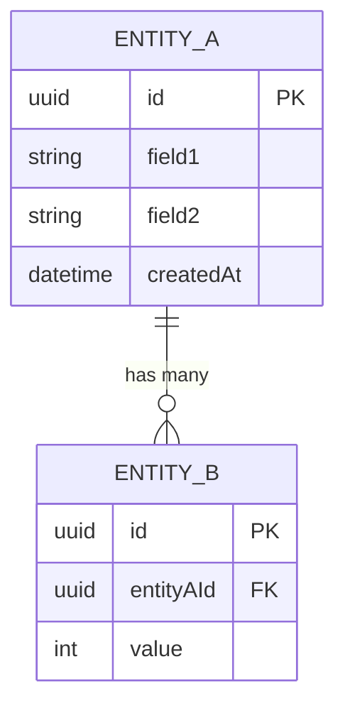
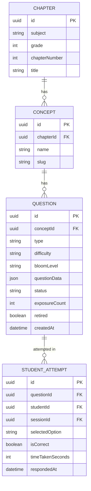

# Skill: plan-db-schema

## Purpose
Produce a high-level entity and relationship plan before the Database Engineer writes Prisma models. This blueprint defines entities, attributes, cardinality, business rules, and indexing hints — giving the DB engineer a clear spec to implement without architectural back-and-forth.

## Used By
- Software Architect Agent (hands off to Database Engineer Agent)

## Inputs
| Input | Type | Description |
| --- | --- | --- |
| `feature_name` | string | The feature being modelled |
| `entities_needed` | array | List of data objects the feature requires |
| `business_rules` | array | Constraints and rules that affect schema design |
| `query_patterns` | array | Most common read queries (determines indexing hints) |

## Template

```markdown
# Data Schema Plan: [Feature Name]

## Entities

| Entity | Description | Soft Delete? |
|---|---|---|
| EntityA | What it represents | Yes / No |
| EntityB | ... | ... |

## Key Attributes per Entity

### EntityA
- `id` — UUID primary key
- `field1` — String, required
- `field2` — Enum (VALUE_A, VALUE_B), default VALUE_A
- `createdAt` — DateTime, auto
- `updatedAt` — DateTime, auto
- `deletedAt` — DateTime?, null = not deleted (if soft delete)

## Entity-Relationship Diagram



## Relationships

| From | To | Cardinality | FK Location | Cascade |
| --- | --- | --- | --- | --- |
| EntityA | EntityB | 1 → many | EntityB.entityAId | Delete EntityA → delete EntityBs |
| EntityB | EntityC | many → many | Junction table EntityB_EntityC | — |

## Business Rules That Affect Schema

1. A student can only have one active game session at a time → `@@unique([studentId, status])` with partial constraint
2. Questions must always belong to a chapter → `chapterId` is required (not optional)
3. XP never decreases → no update on xp field; append-only XP events table

## Indexing Hints (for DB Engineer)

| Query Pattern | Suggested Index |
| --- | --- |
| "Get all live questions for a chapter" | `(chapterId, status)` |
| "Get student's sessions this week" | `(studentId, createdAt DESC)` |
| "Leaderboard by grade" | `(grade, xpTotal DESC)` |

## Data Volume Estimates

| Entity | Year 1 Estimate | Growth Pattern |
| --- | --- | --- |
| Questions | ~10,000 rows | Batch insertions (content pipeline) |
| Students | ~100,000 rows | Steady growth |
| GameSessions | ~2,000,000 rows | High volume — partition by month? |

## Open Questions for DB Engineer

- [ ] Should GameSession responses be stored in a separate table or as JSON on the session? (separate table preferred for analytics)
- [ ] Do we need full audit log for question edits, or just version field?
- [ ] Redis cache for leaderboard or materialised view in PostgreSQL?
```
## Output
A markdown schema plan file at `/docs/architecture/schema-[feature-name].md`

## Quality Checks
- [ ] Every entity has a defined primary key (UUID preferred)
- [ ] All many-to-many relationships have a named junction table
- [ ] Soft delete vs hard delete decision documented for each entity
- [ ] At least 3 indexing hints provided
- [ ] Open questions for DB engineer are specific, not vague

## Example

**Feature:** Question Bank

**Entities:** Question, Concept, Chapter, QuestionPool, StudentAttempt



**Business rules:**
- A question must map to exactly one concept (conceptId required)
- `status` field controls visibility: only `live` questions served to students
- `exposureCount` incremented on every serve; `retired: true` removes from pool

**Indexing hints:**
- `(conceptId, status)` — pool queries
- `(studentId, questionId)` — prevent duplicate attempts
- `(sessionId)` — fetch all attempts for a session
