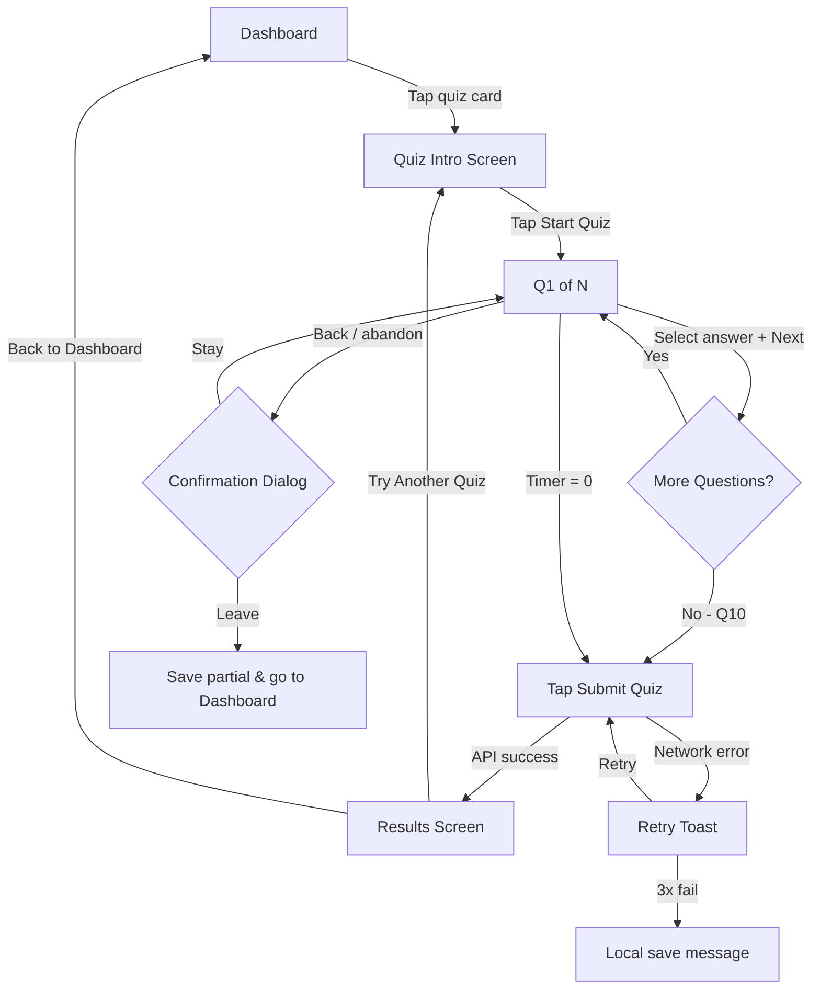

# Skill: Create User Flow

## Purpose
Define the standard method for mapping, documenting, and validating user flows for AceQuest features. A user flow diagram makes explicit every decision point, system response, error state, and alternative path — enabling engineers, QA, and stakeholders to align before any code is written. Flows must cover the happy path, error paths, and edge cases for each age band.

## Used By
- UI/UX Designer Agent
- Product Agent
- Frontend Engineer Agent
- QA Agent

## Inputs
| Field | Type | Description |
|-------|------|-------------|
| `featureName` | string | Feature being mapped, e.g. "Student Quiz Completion" |
| `entryPoints` | string[] | Where the user can start this flow |
| `exitPoints` | string[] | Where the flow ends (success, error, abandon) |
| `actors` | string[] | Who is involved: student, teacher, parent, system |
| `ageBand` | string | Primary age band this flow is designed for |
| `platform` | string | Mobile / Desktop / Both |

## Procedure / Template

### Step 1 — Identify Entry Points and Preconditions

```
Flow: Student Quiz Completion
Actor: Grade 5 Student (Age 10, Band 2)
Platform: Mobile (primary)

Entry Points:
  1. Dashboard → "Recommended Quiz" card tap
  2. Dashboard → Subject area → Quiz list → specific quiz
  3. Teacher shared link (deep link to /quiz/:id)
  4. Parent assigned quiz notification

Preconditions:
  ✓ Student is authenticated (valid session)
  ✓ Quiz exists and status = ACTIVE
  ✓ Student has not already completed this quiz this session

Precondition Failures (entry blocks):
  ✗ Student not logged in → redirect to /login, return to quiz after auth
  ✗ Quiz status = ARCHIVED → show "This quiz is no longer available" screen
  ✗ Session already submitted → show "Already completed" state
```

### Step 2 — Map the Happy Path

```
HAPPY PATH: Student completes quiz successfully

[START]
│
▼
[Dashboard]
│
├─ Tap "Mathematics – Quiz 3"
│
▼
[Quiz Intro Screen]
  Shows: Quiz title, topic, estimated time, question count
  CTA: "Start Quiz"
│
├─ Tap "Start Quiz"
│
▼
[Question Screen — Q1 of 10]
  Shows: Question text, 4 answer options, progress bar, optional timer
│
├─ Tap an answer option
│   → Option highlights; aria-checked updates
│
├─ Tap "Next"
│
▼
[Question Screen — Q2 of 10]  ... repeat for Q3–Q9
│
▼
[Question Screen — Q10 of 10]
  CTA changes from "Next" to "Submit Quiz"
│
├─ Tap "Submit Quiz"
│   → Loading spinner (300–3000ms)
│   → API: POST /api/v1/quizzes/:id/submit
│
▼
[Results Screen]
  Shows: Score %, XP earned, badges unlocked
  CTA Primary: "Try Another Quiz"
  CTA Secondary: "Back to Dashboard"
│
[END — Success]
```

### Step 3 — Map Error and Alternative Paths

```
ERROR PATHS:

─── Network failure during submission ───
[Submit Quiz tap]
│
├─ API call fails (timeout / 5xx)
│
▼
[Toast: "Couldn't save your results. Tap to retry."]
  → Student taps Retry → resubmit with same sessionId (idempotent)
  → If 3 retries fail → show "Something went wrong. Your progress is saved locally."
      (local storage backup, sync on next connection)
  → [END — Partial success / local save]

─── Quiz expires mid-session ───
[Question Screen — Q5]
│
├─ Timer reaches 0 (if quiz has time limit)
│
▼
[Auto-submit triggered] → same as manual submit flow

─── Student abandons mid-quiz ───
[Question Screen — Q3]
│
├─ Student taps Back / navigates away
│
▼
[Confirmation Dialog]
  "You're in the middle of a quiz! If you leave, your progress will be saved."
  [Stay] → returns to Q3
  [Leave] → saves partial progress to localStorage
          → redirects to Dashboard
  [END — Abandoned, progress saved]

─── Device loses connection mid-quiz ───
  → Offline banner appears (PWA) 
  → Answers stored locally
  → On reconnect: sync and submit
  → Results shown after sync confirms

─── Duplicate session attempt ───
[Student reopens quiz in second tab]
│
├─ Quiz already submitted (sessionId in Redis)
│
▼
["You've already completed this quiz! View your results?"]
  [View Results] → /quiz/:id/results
  [END]
```

### Step 4 — Alternative Paths (Intentional Variants)

```
─── Skip and return to question ───
[Question Screen — Q4]
│
├─ Tap "Skip" (Band 2+, not available in Band 1)
│
▼
[Q4 marked as skipped; moves to Q5]
  Progress bar shows Q4 as skipped (hollow circle)
│
... continues to Q10 →
[Pre-submit screen]
  "You skipped 1 question. Review before submitting?"
  [Review Q4] → navigates back to Q4
  [Submit Anyway] → submits with Q4 unanswered (scored as incorrect)

─── Hint request (Band 1 only) ───
[Question Screen]
│
├─ Tap Buddy Owl mascot
│
▼
[Hint speech bubble appears]
  Shows: partial hint text
  [Another Hint?] → second hint (if available)
  [Got it!] → dismisses hint
  (Hint usage recorded — does not affect score but logged for teacher)
```

### Step 5 — Flow Diagram (Mermaid Syntax)



### Step 6 — Flow Annotations by Age Band

| Decision Point | Band 1 (K-2) | Band 2 (3-5) | Band 3 (6-8) |
|----------------|--------------|--------------|--------------|
| Skip question | Not available | Available | Available |
| Timer | Not shown | Optional toggle | On by default |
| Abandon confirmation | "Are you sure?" + Buddy owl | Standard dialog | Brief toast |
| Hint availability | Buddy owl hints | Optional hints | No hints |
| Retry on error | Buddy owl: "Let's try again!" | Standard toast | Technical error message |
| Submission feedback | Star animation + song | XP bar fills + confetti | Score + stats card |

### Step 7 — Flow Acceptance Criteria

```
From this flow, derive testable AC for QA:

✓ Quiz intro screen shows before any questions
✓ Progress bar updates after each question answered
✓ "Submit Quiz" only appears on the last question
✓ Network error shows retry option within 5 seconds
✓ Same sessionId used on retry (idempotency)
✓ Skip button only visible for Band 2 and Band 3 students
✓ Pre-submit review prompt appears if >= 1 question skipped
✓ Abandoning mid-quiz triggers confirmation dialog
✓ Partial answers saved to localStorage on abandon
✓ Duplicate submission returns "already completed" state
```

## Output
- User flow diagram (Mermaid or Figma FlowKit)
- Annotated flow document (this template, filled)
- Band-specific flow variants noted in annotation table
- AC list exported to engineering ticket

## Quality Checks
- [ ] Happy path fully mapped with all screens named
- [ ] Minimum 3 error paths documented: network failure, auth failure, invalid state
- [ ] Abandon/back navigation path explicitly modelled
- [ ] All three age-band variants noted where behaviour differs
- [ ] Each path has a clear END state (success, error, abandoned)
- [ ] Flow shared with engineer, QA, and product before implementation begins
- [ ] AC derived from the flow and included in the engineering ticket
